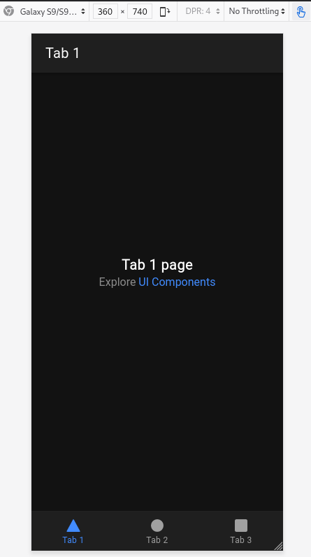
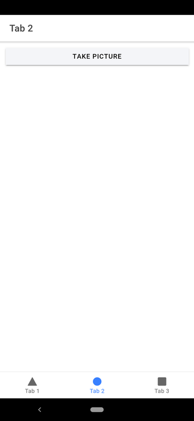
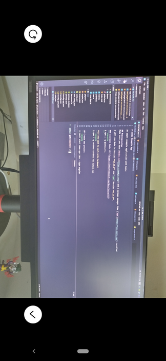
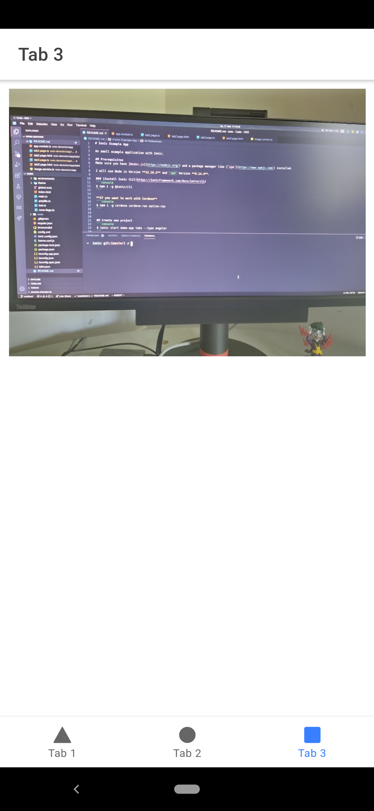

# Ionic Example App

An small example application with Ionic.

## Prerequisites
Make sure you have [Nodes.js](https://nodejs.org/) and a package manager like [`npm`](https://www.npmjs.com/) installed.

I will use Node in Version **12.16.2** and `npm` Version **6.14.4**.

### [Install Ionic CLI](https://ionicframework.com/docs/intro/cli)
```console
$ npm i -g @ionic/cli
```

**if you want to work with Cordova**
```console
$ npm i -g cordova cordova-res native-run
```


## Create new project
```console
$ ionic start ionic-demo tabs --type angular
```
We will create a new Ionic project with a predefined template (tabs) and use angular as frontend framework. Other starter templates are:
* [x] *tabs*         | A starting project with a simple tabbed interface
* [ ] *sidemenu*     | A starting project with a side menu with navigation in the content area
* [ ] *blank*        | A blank starter project
* [ ] *list*         | A starting project with a list
* [ ] *my-first-app* | An example application that builds a camera with gallery
* [ ] *conference*   | A kitchen-sink application that shows off all Ionic has to offer

~~While the creation process, we choose [Capacitor](https://capacitor.ionicframework.com/docs/) as native runtime, default is currently [Cordova](https://cordova.apache.org/).~~  
While the creation process, we choose the default native runtime [Cordova](https://cordova.apache.org/), instead of the new [Capacitor](https://capacitor.ionicframework.com/docs/).

We can run a live serve with the following command.
```console
$ cd demo-app
$ ionic serve
```



### Add native Plugin ([camera](https://ionicframework.com/docs/native/camera))
```console
$ npm install @ionic-native/camera
```

**Cordova**
```console
$ ionic cordova plugin add cordova-plugin-camera
```

**if you use Capacitor**
```console
$ npm install cordova-plugin-camera
$ ionic cap sync
```

### Add Android to Project
**Cordova**
```console
$ ionic cordova plugin add android
```

**Capacitor**
```console
$ ionic cap add android
$ ionic cap sync
```

### Build/Run on Android Device (or Emulator)
**Cordova**
```console
$ ionic cordova run android
```

**Capacitor**
From this point, work with Android Studio to build/run Android application.

### Code
Take a look on the code in [Tab2](ionic-demo/src/app/tab2) and [Tab3](ionic-demo/src/app/tab3).






## References
* [Ionic Framework](https://ionicframework.com/)
* [Ionic CLI](https://ionicframework.com/docs/cli)
